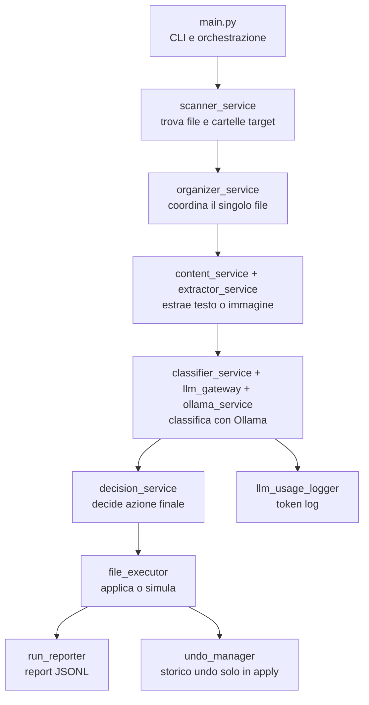
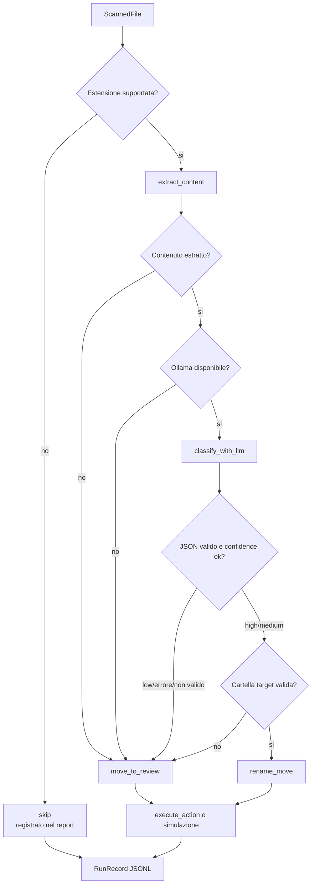

# Architecture

Questa guida spiega come e organizzato `ollama-folder-organizer-clean` e come leggere il codice senza perdersi.

## 1. Mappa ad alto livello

Il programma e una pipeline: ogni file passa attraverso una serie di passaggi piccoli e separati.



Il default e sicuro:

```bash
python main.py "/percorso/cartella"
```

esegue un dry-run. Per modificare davvero i file serve:

```bash
python main.py "/percorso/cartella" --apply
```

## 2. Flusso di esecuzione

`main.py` e il punto di ingresso. Fa poche cose:

1. Legge argomenti CLI e `.env`, se `python-dotenv` e installato.
2. Crea un `session_id`.
3. Prepara report operativo e token log.
4. Legge le cartelle target esistenti nella root.
5. Verifica Ollama e costruisce `LLMGateway`.
6. In `--apply`, crea `DaRevisionare` e apre una sessione undo.
7. Scansiona i file.
8. Processa ogni file con `process_scanned_file`.
9. Scrive una riga JSONL nel report per ogni file.
10. Stampa un riepilogo finale.

Il flusso del singolo file e:



## 3. Scheda dei moduli

### `main.py`

Responsabilita:

- definisce la CLI;
- decide dry-run vs `--apply`;
- crea report, token log e undo manager;
- invoca scanner e pipeline file;
- stampa lo stato finale.

Input principale:

- `input_dir`;
- `--apply`;
- configurazione Ollama: `--model`, `--vision-model`, `--base-url`, `--timeout`.

Output:

- console summary;
- `.organizer_reports/<sessione>.jsonl`;
- `.organizer_logs/<sessione>.llm_usage.jsonl`;
- `.organizer_history.json` solo in `--apply`.

Non dovrebbe:

- estrarre contenuti;
- parlare direttamente con Ollama;
- decidere regole di classificazione;
- spostare file direttamente.

### `services/scanner_service.py`

Responsabilita:

- legge le cartelle target esistenti nella root;
- aggiunge sempre `DaRevisionare` come target logico;
- scansiona ricorsivamente la cartella;
- salta cartelle target, `DaRevisionare`, file nascosti e `.organizer_*`.

Input:

- cartella root;
- lista target folders.

Output:

- lista di `ScannedFile`.

Punto importante: se una cartella si chiama come una categoria target, i file al suo interno non vengono riprocessati.

### `services/content_service.py`

Responsabilita:

- sceglie quale estrattore usare in base al tipo file;
- converte un `ScannedFile` in `ExtractedContent`.

Input:

- `ScannedFile`.

Output:

- `ExtractedContent` con `text`, `image_data` e `metadata`.

Non dovrebbe:

- chiamare Ollama;
- decidere dove spostare il file.

### `services/extractor_service.py`

Responsabilita:

- estrarre testo da PDF, DOCX, XLSX, PPTX e file testuali;
- creare thumbnail/base64 per immagini o PDF scansionati;
- rispettare `TRUNCATION_LIMITS` in `constants_py.py`.

Nota: gli import pesanti (`fitz`, `openpyxl`, `docx`, `pptx`, `PIL`) sono lazy, quindi vengono caricati solo quando serve quel formato.

### `services/classifier_service.py`

Responsabilita:

- inviare contenuto e cartelle disponibili al gateway LLM;
- parsare il JSON restituito da Ollama;
- validare lo schema base;
- riprovare con `repair_output` se il JSON non e valido.

Schema atteso:

```json
{"new_name":"NomeFileSenzaEstensione","target_folder":"CartellaEsistente","confidence":"high|medium|low","reason":"Motivo breve"}
```

Output:

- `ClassificationResult`.

Regola importante: se `confidence` non e `high`, `medium` o `low`, viene forzata a `low`.

### `services/llm_gateway.py`

Responsabilita:

- aggiungere retry alle chiamate LLM;
- registrare token, durata, tentativi ed errori tramite `LLMUsageLogger`.

Non costruisce prompt e non interpreta decisioni filesystem.

### `services/ollama_service.py`

Responsabilita:

- parlare con Ollama via HTTP;
- costruire il payload `/api/chat`;
- ripulire l'output rimuovendo markdown/code block;
- controllare i modelli installati.

Input:

- prompt system;
- payload user;
- eventuale immagine base64.

Output:

- `LLMResponse` con contenuto JSON string, modello, token e durata.

### `services/decision_service.py`

Responsabilita:

- trasformare una classificazione in un'azione concreta.

Azioni possibili:

- `rename_move`: rinomina e sposta nella cartella target;
- `move_to_review`: sposta in `DaRevisionare`;
- `skip`: ignora file non supportati.

Regole chiave:

- `confidence low` va sempre in `DaRevisionare`;
- cartella target non esistente va in `DaRevisionare`;
- nome incerto va in `DaRevisionare`;
- in `DaRevisionare` il nome originale viene mantenuto.

### `services/file_executor.py`

Responsabilita:

- applicare una `FileAction`;
- in dry-run non modifica il filesystem;
- in `--apply` crea la cartella destinazione e sposta il file;
- registra undo solo dopo uno spostamento riuscito.

Non decide l'azione: la esegue soltanto.

### `services/run_reporter.py`

Responsabilita:

- scrivere il report operativo JSONL;
- convertire `FileAction` e `ScannedFile` in `RunRecord`.

Ogni riga contiene almeno:

- `old_path`;
- `old_name`;
- `new_name`;
- `target_path`;
- `action`;
- `status`;
- `reason`;
- `dry_run`;
- `file_type`.

### `services/undo_manager.py`

Responsabilita:

- creare una sessione undo;
- registrare mosse reali;
- annullare l'ultima sessione completata.

Punto importante: viene usato solo in `--apply`. Un dry-run non crea storico undo.

### `services/naming.py`

Responsabilita:

- sanitizzare nomi file;
- riconoscere nomi incerti;
- calcolare path unici con suffissi `_2`, `_3`, ecc.

### `constants_py.py`

Contiene:

- `TRUNCATION_LIMITS`;
- `REVIEW_FOLDER`;
- prefisso file/cartelle organizer;
- prompt tipizzati;
- estensioni supportate.

I prompt sono parte del contratto con Ollama: se cambi lo schema JSON richiesto, devi aggiornare anche `classifier_service.py`.

## 4. Glossario dei tipi

### `ScannedFile`

Rappresenta un file trovato dallo scanner.

Campi principali:

- `path`: path assoluto;
- `root_dir`: root della run;
- `relative_path`: path relativo alla root;
- `name`: nome file originale;
- `extension`: estensione in minuscolo;
- `file_type`: tipo logico, oppure `None` se non supportato;
- `size`: dimensione in byte.

### `ExtractedContent`

Rappresenta il contenuto utilizzabile dall'LLM.

Campi:

- `text`: testo estratto;
- `image_data`: immagine base64;
- `metadata`: dati accessori.

Metodi utili:

- `has_content()`;
- `to_llm_payload()`.

### `ClassificationResult`

Rappresenta la risposta interpretata da Ollama.

Campi:

- `new_name`;
- `target_folder`;
- `confidence`;
- `reason`;
- `raw`.

### `FileAction`

Rappresenta cosa il programma intende fare.

Campi:

- `action`: `rename_move`, `move_to_review`, `skip`;
- `old_path`;
- `new_path`;
- `new_name`;
- `target_folder`;
- `status`;
- `reason`.

### `RunRecord`

Rappresenta una riga del report JSONL.

Serve per studiare cosa e successo senza leggere il codice o i log tecnici.

## 5. Walkthrough: esempio con `fattura.pdf`

Immagina questa struttura:

```text
Archivio/
  Fatture/
  Contratti/
  fattura.pdf
```

Esegui:

```bash
python main.py Archivio
```

Succede questo:

1. `main.py` crea una sessione dry-run.
2. `scanner_service` legge le target folders: `Fatture`, `Contratti`, `DaRevisionare`.
3. La scansione ricorsiva salta `Fatture`, `Contratti` e `DaRevisionare`.
4. Trova `fattura.pdf` e crea uno `ScannedFile`.
5. `content_service` vede `file_type = pdf`.
6. `extractor_service` estrae testo dalle prime pagine secondo `TRUNCATION_LIMITS`.
7. `classifier_service` invia testo, nome originale e cartelle disponibili a Ollama.
8. Ollama dovrebbe rispondere, ad esempio:

```json
{"new_name":"2026-05 Fattura Cliente Alfa","target_folder":"Fatture","confidence":"high","reason":"Documento fiscale con cliente e data"}
```

9. `decision_service` vede `confidence high` e target valida.
10. Produce una `FileAction` `rename_move`.
11. In dry-run `file_executor` non sposta nulla.
12. `main.py` riserva comunque il path pianificato, per simulare collisioni.
13. `run_reporter` scrive una riga in `.organizer_reports/<sessione>.jsonl`.

Se invece esegui:

```bash
python main.py Archivio --apply
```

allora il file diventa:

```text
Archivio/
  Fatture/
    2026-05 Fattura Cliente Alfa.pdf
  Contratti/
  DaRevisionare/
```

e la mossa viene registrata in `.organizer_history.json`.

## 6. Punti critici da ricordare

### Dry-run vs `--apply`

Dry-run:

- non rinomina;
- non sposta;
- non crea `DaRevisionare`;
- scrive report e token log.

Apply:

- crea `DaRevisionare` se manca;
- rinomina e sposta;
- aggiorna undo.

### `DaRevisionare`

E la destinazione per casi non affidabili:

- contenuto non estraibile;
- Ollama non disponibile;
- errore LLM;
- JSON non valido non riparabile;
- `confidence low`;
- cartella target non valida;
- nome incerto.

In revisione il file mantiene il nome originale.

### Cartelle target

Lo script usa solo cartelle gia esistenti nella root.

Non crea categorie nuove da Ollama. Questo evita cartelle inventate o duplicate.

### JSON di Ollama

Il contratto e fragile se prompt e parser divergono.

Se modifichi i prompt in `constants_py.py`, controlla anche:

- `classifier_service.parse_classification`;
- i test su parsing/classificazione.

### Collisioni nomi

Se il target esiste gia, `unique_path` aggiunge suffissi:

```text
Nome.pdf
Nome_2.pdf
Nome_3.pdf
```

Anche il dry-run simula collisioni tra file della stessa run con `_reserve_dry_run_path`.

### Undo

Undo lavora solo su sessioni `--apply` completate.

Se uno spostamento fallisce, non viene registrato come riuscito.

## 7. Come studiare il codice

Ordine consigliato:

1. Leggi `main.py` per capire il ciclo generale.
2. Leggi `organizer_types.py` per fissare i dati mentali.
3. Leggi `scanner_service.py` e `decision_service.py`, che contengono le regole piu importanti.
4. Leggi `organizer_service.py`, che unisce i passaggi del singolo file.
5. Leggi `classifier_service.py` e `ollama_service.py` per capire il contratto LLM.
6. Leggi `tests/test_organizer.py`: sono la specifica viva dei comportamenti principali.

Comando utile:

```bash
python3 -m unittest discover -s tests
```

Un buon esercizio e cambiare una regola piccola e aggiornare prima il test, poi il codice.
